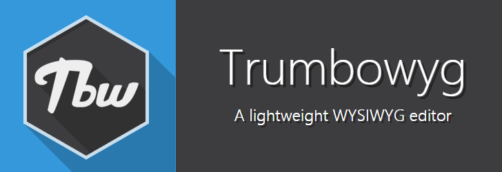

# Trumbowyg WYSIWYG Editor

Trumbowyg is a simple and lightweight WYSIWYG editor, is only 15kB for faster page loading.

Visit presentation page : http://alex-d.github.io/Trumbowyg/

# Documentation

All you need to know about Trumbowyg is here : http://alex-d.github.io/Trumbowyg/documentation.html (or [on the home](http://alex-d.github.io/Trumbowyg/))

# Contribute

You can contribute to Trumbowyg with translations in languages you know.
Thanks to `node` and `gulp`, you can improve core script, style or icons easily.

## Getting Started

- Clone the repository
- `cd Trumbowyg` to go into the project's root directory
- `npm install` to install development dependencies
- `npm install -g bower gulp` to install bower and gulp command if you don't have them already
- `bower install` to install Trumbowyg dependencies (ie: jQuery)
- `gulp build` to build the project

`gulp` command launch default Gulp task watcher and rebuild on the fly.

# License

This project is under MIT license. See [LICENSE](LICENSE) file for details.
