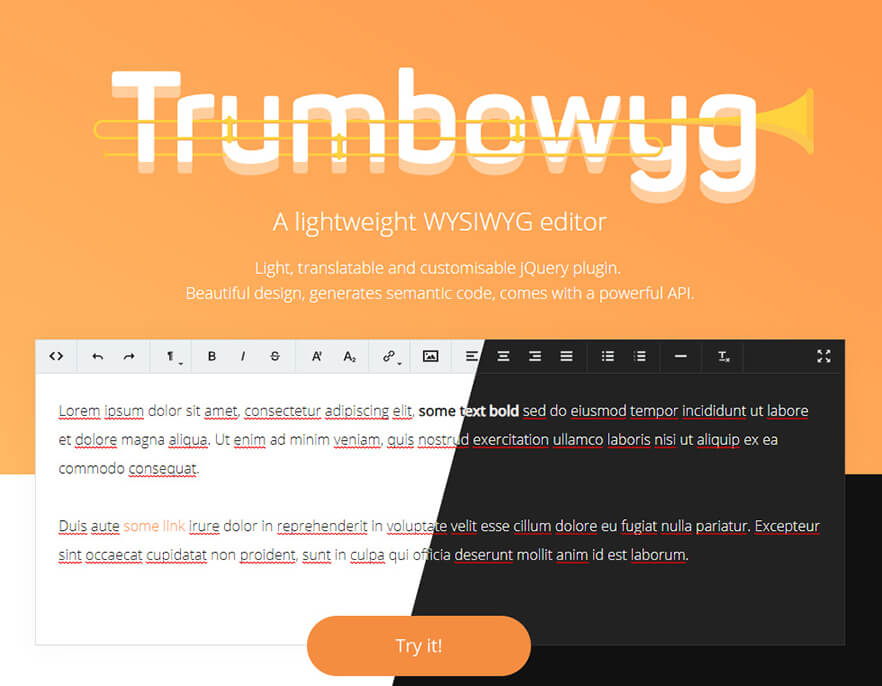

<p align="center">
    <a href="http://alex-d.github.io/Trumbowyg/"></a>
</p>

<p align="center">
    <a href="https://bundlephobia.com/result?p=trumbowyg"></a>
    <a href="https://www.npmjs.com/package/trumbowyg"></a>
    <a href="https://github.com/Alex-D/Trumbowyg/blob/develop/LICENSE"></a>
    <br>
    <a href="https://www.npmjs.com/package/trumbowyg"></a>
    <a href="https://cdnjs.com/libraries/Trumbowyg"></a>
    
</p>


<h2 align="center">Supporting Trumbowyg</h2>

Trumbowyg is an MIT-licensed open source project and completely free to use.

However, the amount of effort needed to maintain and develop new features for 
the project is not sustainable without proper financial backing. 
You can support it's ongoing development by being a backer or a sponsor:
 
- [Become a backer or sponsor on Patreon](https://www.patreon.com/alexandredemode)
- [One-time donation via PayPal](https://www.paypal.me/demodealexandre/20eur)

<h3 align="center">Sponsors</h3>

<h4 align="center">Gold</h4>

<p align="center">
    <a href="https://avot.nl/?ref=trumbowyg">
        
    </a>
    &nbsp;&nbsp;&nbsp;&nbsp;&nbsp;
    <a href="https://bookingninja.io/?ref=trumbowyg">
        
    </a>
</p>

<p align="center">
    <a href="https://www.patreon.com/bePatron?c=1176005&rid=1940456">
        Become a Sponsor
    </a>
</p>

<h4 align="center">Silver</h4>

<p align="center">
    <a href="https://socialoptic.com/?ref=trumbowyg">
        
    </a>
</p>

<p align="center">
    <a href="https://www.patreon.com/bePatron?c=1176005&rid=1940456">
        Become a Sponsor
    </a>
</p>

------------------------------------

## Introduction

Trumbowyg is a simple and lightweight WYSIWYG editor, weight only 20kB minifed (8kB gzip) for faster page loading.

Visit presentation page: http://alex-d.github.io/Trumbowyg/


## Documentation

All you need to know about Trumbowyg is here: http://alex-d.github.io/Trumbowyg/documentation/ (or even [on the home](http://alex-d.github.io/Trumbowyg/#get-started))


## Contribution

You can contribute to Trumbowyg with translations in languages you know.
Thanks to `node` and `gulp`, you can improve core script, style or icons easily.

First, fork and clone the repository

```bash
cd Trumbowyg # to go into the project's root directory
npm install # to install development dependencies
npm install -g bower gulp # to install bower and gulp command if you don't have them already
bower install # to install Trumbowyg dependencies (ie: jQuery)
gulp build # to build the project
```

`gulp` command launch default Gulp task watcher and rebuild on the fly.


## Stay in touch

For the latest release and announcements, follow on Twitter: [@AlexandreDemode](https://twitter.com/AlexandreDemode)


## License

This project is under [MIT license](LICENSE).
